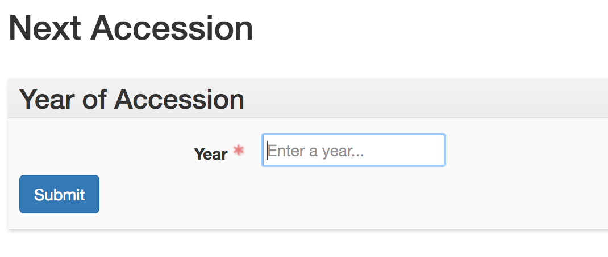
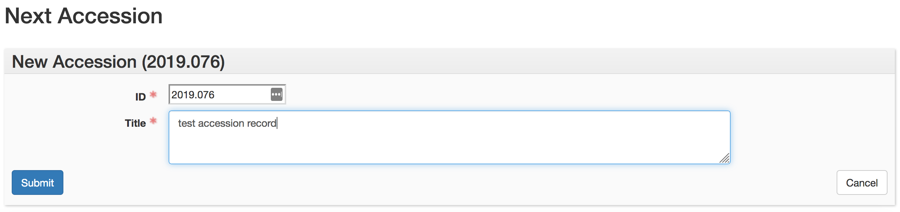

# Next Accession

This plugin generates the next accession identifier in sequence for the accession year provided by a user, then provides a form where the user may provide the accession title. This process creates a stub accession record in the database, where the user may then provide additional information about the accession being processed.

The University of Denver assigns identifiers to its accessions based on the order in which they are processed in a calendar year. The numbering schema is therefore based on the calendar year, and additionally includes a zero-padded three-digit number identifying the order of that accession's arrival in that calendar year. For example, "2016.100" represents the 100th accession received between 2016 January 1 and 2016 December 31.

## How the plugin works

The plugin contains a [custom API call](https://github.com/duspeccoll/next_accession/blob/master/backend/controllers/next_accession.rb) that takes as input the year in which the accession was processed. It then gets the list of all accessions in the database, builds an array of just those accessions whose identifiers begin with the year provided, and checks to see what the last number in the sequence is. The API adds one to that number in order to generate the accession ID it then returns.

In the frontend, a user enters the year in which the accession was received:

Upon clicking the "Submit" button, a second form is presented, containing the accession identifier generated by the plugin. The user may then enter a title for the accession:

Once the title is entered, clicking "Submit" will generate a new accession record with the provided identifier and title. The user may then provide any additional metadata required to fully describe the accession, in line with the ArchivesSpace and local guidelines for accessions. Clicking "Cancel" will return the user to the plugin index page.
